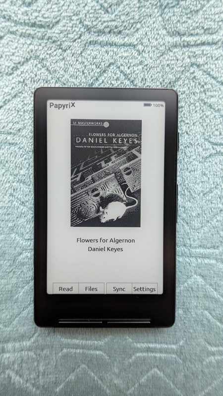

# Papyrix

[](CHANGELOG.md)
[](docs/user_guide.md)
[](docs/customization.md)
[](docs/fonts.md)
[](docs/architecture.md)
[](docs/device-specifications.md)
[](docs/x4-specifications.md)
[](docs/x3-specifications.md)
[](docs/file-formats.md)
[](docs/images.md)
[](docs/ssd1677-driver.md)
[](docs/webserver.md)
[](docs/calibre.md)


Papyrix is firmware for Xteink X3, X4, and X4 Pro e-paper readers.
It uses one ESP32-C3 image for X3/X4 and one ESP32-S3 image for X4 Pro.

> **Warning:** Some Xteink units (for example, units from AliExpress) lock USB flash.
> If USB flash is locked, you cannot update or recover through USB.
> Install, update, and do [emergency recovery](#emergency-recovery) from the SD card.
> Flash through USB only on devices that have unlocked USB.



This project is **not affiliated with Xteink**.
It is a community project.

## Supported devices

| Device | Release file | Panel |
|---|---|---|
| Xteink X4 | `papyrix-xteink-c3.bin` | 800×480 SSD1677 |
| Xteink X3 | `papyrix-xteink-c3.bin` | 792×528 UC8253 or UC8279 |
| Xteink X4 Pro | `papyrix-x4pro.bin` | 800×480 UC8279 or UC8179 |

See the [device support matrix](docs/device-support-matrix.md) for build targets and hardware services.
Using the wrong binary can drive incorrect pins and can damage hardware.

Page caches use profile-specific folders. Moving an SD card between supported
devices does not reuse incompatible rendered pages.

## Features

### Reading & Format Support
- [x] EPUB 2 and EPUB 3 parse (nav.xhtml, with NCX as fallback)
- [x] CSS stylesheet parse (text-align, font-style, font-weight, text-indent, margins, direction)
- [x] Preformatted text (`<pre>`) and inline code (`<code>`, `<tt>`, `<kbd>`, `<samp>`) shown as italic (no monospace font in the firmware)
- [x] FB2 (FictionBook 2.0) with metadata, TOC navigation, and metadata cache (no inline images)
- [x] HTML (.html, .htm) files (standalone HTML documents)
- [x] XTC/XTCH native format
- [x] Markdown (.md, .markdown) files with formatting
- [x] Plain text (.txt, .text) files
- [x] Saved reading position
- [x] Books that you opened before (Books screen) so you can continue quickly
- [x] Reading statistics for each book (progress, reading time, and sessions)
- [x] Bookmarks (maximum 20 for each book, saved on the SD card)
- [x] Book cover display (JPG/JPEG/PNG/BMP, case-insensitive)
- [x] Table of contents navigation
- [x] Images in EPUB (JPEG/PNG/BMP, baseline JPEG only, maximum 2048×3072)

### Text & Display
- [x] Font sizes that you can set (XSmall/Small/Normal/Large)
- [x] Paragraph alignment (Justified/Left/Center/Right)
- [x] Text layout presets (Compact/Standard/Large) for indent and spacing
- [x] Soft hyphen support for text layout
- [x] Liang-pattern hyphenation. Language comes from EPUB metadata (de, en, es, fr, it, ru, uk)
- [x] Vietnamese, Thai, Greek, and Arabic in the builtin fonts
- [x] CJK (Chinese/Japanese/Korean) text layout (book text only, not UI)
- [x] Thai text with correct mark positions
- [x] Arabic text shaping. Contextual forms and Lam-Alef ligatures with RTL layout
- [x] Knuth-Plass line break algorithm (TeX-quality justified text)
- [x] Text anti-aliasing on/off (grayscale text for builtin fonts and custom fonts)
- [x] Pages per refresh setting (1/5/10/15/30)
- [x] Sunlight fading fix (powers down the display after refresh to prevent UV fade)
- [x] Turbo LUTs with LUT cache for faster X3 page turns
- [x] 4 screen orientations

### Customization
- [x] Custom themes from the SD card (`/config/themes/`)
- [x] Custom fonts from the SD card (`/config/fonts/`, .epdfont format)
- [x] Custom sleep screens (Dark/Light/Custom/Cover/Keep Page modes)
- [x] Button remapping (side buttons and front buttons)
- [x] Power button actions (page turn, bookmark, or sleep on a short press)

### Network & Connectivity
- [x] WiFi file transfer (web server)
- [x] Calibre Wireless Device. Send books from Calibre desktop

### Maintenance
- [x] Cleanup menu (clear book cache, empty trash, clear storage, factory reset)
- [x] Firmware updates from the SD card
- [x] System info (version, uptime, memory, storage)

### File System
- [x] exFAT and FAT32 SD card support
- [x] UTF-8 filenames through the Web UI for Latin (including Vietnamese), Cyrillic, Greek, Thai, and Arabic
- [x] File explorer with nested folders
- [x] Recycle bin (`/trash`). If you delete a book, the device moves it to `/trash`. It does not remove the book. You can browse to restore it or delete it permanently. You can empty the trash from the Cleanup menu
- [x] Hidden system folder filter (LOST.DIR, $RECYCLE.BIN, and other system folders)

> **Tip:** The Web UI folder create, upload, and rename functions change supported Unicode names to NFC. Names have a limit of 255 UTF-8 bytes. Full paths have a limit of 1023 bytes. CJK filenames are not supported. The device file-browser UI does not have CJK glyphs. For deep folder trees with supported non-Latin names, use exFAT, not FAT32.

See [the user guide](docs/user_guide.md) for operation procedures.
See the [customization guide](docs/customization.md) for themes and fonts.
Example theme files and font files are in [`docs/examples/`](docs/examples/).

### Installing & Firmware Updates

> Do you need to recover a device that does not start? [Go to emergency recovery](#emergency-recovery).

Download the binary that matches the device:

- X3 or X4: `papyrix-xteink-c3.bin`
- X4 Pro: `papyrix-x4pro.bin`

The usual installation method is
**[papyrix-flasher](https://github.com/bigbag/papyrix-flasher)**:

```bash
papyrix-flasher flash papyrix-xteink-c3.bin
```

Do not flash an S3 image to a C3 device or a C3 image to an S3 device.

**From SD card:** You can also install or update with an SD card:

1. Copy the firmware file as `/firmware.bin` to the root of your SD card.
2. Put the SD card into the device.
3. Go to **Settings > Firmware Update** and press **Run**.

The device flashes the firmware from the SD card and restarts.

#### Emergency Recovery

If the device does not start, copy the firmware as `/force_update.bin` to the SD card.
On the next start, the device flashes the file before it starts the UI.
You do not need to operate the device.

See the [customization guide](docs/customization.md) for more data.

## Development

### Prerequisites

* **PlatformIO Core** (`pio`) or **VS Code + PlatformIO IDE**
* Python 3.12+ with [uv](https://docs.astral.sh/uv/) (for font conversion)
* Node.js 18+ (for sleep screen scripts and logo scripts)
* USB-C data cable
* Xteink X3, X4, or X4 Pro with unlocked USB flashing

Install Node.js dependencies (for sleep screen scripts and logo scripts):
```bash
cd scripts && npm install
```

### Using Nix

If you have [Nix](https://nixos.org/), `shell.nix` supplies all dependencies:

```bash
# Enter development environment
nix-shell

# Or run commands directly
nix-shell --run "make build"
nix-shell --run "make check"
```

First-time Nix setup:
```bash
# Install Nix (if not installed)
sh <(curl -L https://nixos.org/nix/install) --daemon

# Add nixpkgs channel
nix-channel --add https://nixos.org/channels/nixos-unstable nixpkgs
nix-channel --update
```

### Checking out the code

Papyrix uses PlatformIO to build and flash the firmware. Clone the repository:

```
git clone --recursive https://github.com/pliashkou/papyrix

# Or, if you've already cloned without --recursive:
git submodule update --init --recursive
```

### Building

```sh
# Build development firmware
make build

# Build both release environments
make release

# Build, verify, and package deterministic release files in dist/
make package
```

### Flashing your device

Connect the device through unlocked USB.
Build and flash the release firmware for the device:

```sh
make flash-xteink-c3  # X3 and X4
make flash-x4pro      # X4 Pro
```

On X4 Pro, hold Power throughout flashing.
Release Power after verification completes and the application starts.
Close the serial monitor before flashing.
To select a port:

```sh
PLATFORMIO_UPLOAD_PORT=/dev/ttyACM0 make flash-x4pro
```

`make flash-release` and `make upload-release` select X3/X4 only.
To install an existing release binary instead of building it, use:

```sh
# ESP32-C3: X3/X4
esptool.py --chip esp32c3 --port /dev/ttyACM0 --baud 460800 \
  write_flash -z 0x10000 papyrix-xteink-c3.bin

# ESP32-S3: X4 Pro
esptool.py --chip esp32s3 --port /dev/ttyACM0 --baud 460800 \
  write_flash -z 0x10000 papyrix-x4pro.bin
```

PlatformIO upload remains available for a connected development target:

```sh
pio run -e default --target upload
pio run -e x4pro --target upload
```

Replace `/dev/ttyACM0` with the device port. Use `COM3` on Windows or
`/dev/tty.usbmodem*` on macOS where applicable.

### Build Scripts

Build scripts are in the `scripts/` directory.

#### Converting fonts

Convert TTF/OTF fonts to the Papyrix `.epdfont` format with Python (you need [uv](https://docs.astral.sh/uv/)):

```bash
# Basic conversion (outputs to current directory)
uv run scripts/fontconvert.py my-font -r MyFont-Regular.ttf --2bit

# Full font family with all reader sizes (14, 16, 18pt)
uv run scripts/fontconvert.py my-font -r Regular.ttf -b Bold.ttf --2bit --all-sizes -o /tmp/fonts/

# With Thai script support
uv run scripts/fontconvert.py my-font -r Regular.ttf --2bit --thai -o /tmp/fonts/

# With Arabic script support
uv run scripts/fontconvert.py my-font -r Regular.ttf --2bit --arabic -o /tmp/fonts/

# Generate C header instead of binary (for builtin fonts)
uv run scripts/fontconvert.py my_font 16 Regular.ttf --2bit > my_font_16_2b.h
```

Options: `-r/--regular`, `-b/--bold`, `-i/--italic`, `-o/--output`, `-s/--size`, `--2bit`, `--all-sizes`, `--header`, `--thai`, `--arabic`

See the [customization guide](docs/customization.md) for the full font conversion procedure.

#### Creating sleep screen images

Convert an image to the sleep screen BMP format (run `cd scripts && npm install` first):

```bash
# With Makefile
make sleep-screen INPUT=photo.jpg OUTPUT=sleep.bmp
make sleep-screen INPUT=photo.jpg OUTPUT=sleep.bmp ARGS='--dither --bits 8'

# Or directly
cd scripts && node create-sleep-screen.mjs photo.jpg sleep.bmp --dither --bits 8
```

Options:
- `--orientation portrait|landscape` - Screen orientation (default: portrait)
- `--bits 2|4|8` - Output bit depth (default: 4)
- `--dither` - Enable Floyd-Steinberg dithering
- `--fit contain|cover|stretch` - Resize mode (default: contain)

Copy the output BMP to the `/sleep/` directory or as `/sleep.bmp` on the SD card.

#### Converting logo

Convert an image to a C header for the firmware logo (128x128 monochrome):

```bash
cd scripts && node convert-logo.mjs logo.png ../src/images/PapyrixLogo.h
```

Options: `--invert`, `--threshold <0-255>`, `--rotate <0|90|180|270>`

#### Calibre simulators (development/testing)

Two simulators let you test the Calibre Wireless Device feature with no real hardware:

```bash
cd scripts

# Simulate a Papyrix device (for testing Calibre desktop connection)
node device-simulator.mjs

# Simulate Calibre desktop (for testing device firmware)
node calibre-simulator.mjs
```

The device simulator listens for Calibre broadcasts and can receive books (saved to `scripts/received_books/`). The Calibre simulator sends discovery packets and sends test books to connected devices.

#### Serial monitor

A standalone Go binary reads device logs with no PlatformIO. Pre-built binaries are on the [releases page](https://github.com/pliashkou/papyrix/releases). You can also build from source:

```bash
cd tools/monitor && go build -o monitor .
```

Usage:
```bash
./monitor                                  # Auto-detect port
./monitor -port /dev/ttyACM0               # Explicit port
./monitor -port /dev/ttyACM0 -log out.txt  # Also save to file
./monitor -speed 921600                    # Custom baud rate (default: 115200)
```

#### Reader test (desktop)

A desktop tool tests the content parse pipeline (EPUB, FB2, HTML, TXT, Markdown) with no flash to hardware. Use it to find parse defects, layout defects, or crashes.

```bash
# Build only
make reader-test

# Build and process a book
make reader-test FILE=book.epub OUTPUT=/tmp/cache

# Dump parsed text content of each page
tools/reader-test/build/reader-test --dump book.epub /tmp/cache
```

Options:
- `--dump` — Print the parsed text of each page (use this to verify entity resolution, text extraction, and layout)

### Creating a GitHub release

```sh
# With auto-generated notes from commits
make gh-release VERSION=0.1.1

# With custom notes
make gh-release VERSION=0.1.1 NOTES="Release notes here"
```

### Generating changelog

Make `CHANGELOG.md` from git tags and commit history:

```sh
make changelog
```

This makes a changelog grouped by version tags, with commit messages and author data.

## Internals

Papyrix is made for the ESP32-C3 limit of approximately 380KB RAM. See [docs/architecture.md](docs/architecture.md) for the architecture.

### Data caching

The device caches book data on the SD card. X4 uses `/.papyrix/cache/`, X3 uses
`/.papyrix/cache/x3/`, and X4 Pro uses `/.papyrix/cache/x4pro/`.
Each device-specific directory contains the book folders shown below.


```
<device-cache>/
├── epub_12471232/       # Each EPUB is cached to a subdirectory named `epub_<hash>`
│   ├── progress.bin     # Stores reading progress (chapter, page, etc.)
│   ├── bookmarks.bin    # Saved bookmarks (up to 20 per book)
│   ├── bookmarks.txt    # Human-readable bookmark list (companion to bookmarks.bin)
│   ├── cover.bmp        # Book cover image (once generated)
│   ├── book.bin         # Book metadata (title, author, spine, table of contents, etc.)
│   ├── sections/        # All chapter data is stored in the sections subdirectory
│   │   ├── 0.bin        # Chapter data (screen count, all text layout info, etc.)
│   │   ├── 1.bin        #     files are named by their index in the spine
│   │   └── ...
│   └── images/          # Cached inline images (converted to 2-bit BMP)
│       ├── 123456.bmp   # Images named by hash of source path
│       └── ...
│
├── fb2_55667788/        # Each FB2 file is cached to a subdirectory named `fb2_<hash>`
│   ├── meta.bin         # Cached metadata (title, author, TOC) for faster reloads
│   ├── progress.bin     # Stores reading progress
│   ├── cover.bmp        # Cover image (converted from adjacent image file)
│   ├── sections/        # Cached chapter pages (same format as EPUB sections)
│   │   ├── 0.bin
│   │   └── ...
│
│
├── txt_98765432/        # Each TXT file is cached to a subdirectory named `txt_<hash>`
│   ├── progress.bin     # Stores current page number (4-byte uint32)
│   ├── index.bin        # Page index (byte offsets for each page start)
│   └── cover.bmp        # Cover image (converted from book.jpg/png/bmp or cover.jpg/png/bmp)
│
├── md_12345678/         # Each Markdown file is cached to a subdirectory named `md_<hash>`
│   ├── progress.bin     # Stores current page number (2-byte uint16)
│   ├── section.bin      # Parsed pages (same format as EPUB sections)
│   └── cover.bmp        # Cover image (converted from README.jpg/png/bmp or cover.jpg/png/bmp)
│
├── html_12345678/       # Each HTML file is cached to a subdirectory named `html_<hash>`
│   ├── progress.bin     # Stores current page number (4-byte, same as TXT/Markdown)
│   ├── pages_<fontId>.bin  # Parsed pages (same format as Markdown/FB2 sections)
│   └── cover.bmp        # Cover image (converted from adjacent image file)
│
└── epub_189013891/
```

To clear cached data, use **Settings > Cleanup** (see [User Guide](docs/user_guide.md)). You can also delete the `.papyrix` directory.

The cache does not clear automatically when you delete a book. If you move a book file, the device uses a new cache directory. This resets the reading progress.

See [file formats](./docs/file-formats.md) for cache records.
See the [rendering pipeline](./docs/rendering-pipeline.md#page-cache) for cache scheduling and ownership.

## Related Tools

### EPUB to XTC Converter (Web)

[epub-to-xtc-converter](https://github.com/bigbag/epub-to-xtc-converter) — browser-based converter from EPUB to the Xteink native XTC/XTCH format. It uses CREngine WASM for accurate rendering.

- Device presets for Xteink X4/X3 (480x800)
- Font selection from Google Fonts or custom TTF/OTF
- Margins, line height, and hyphenation that you can set (42 languages)
- Dark mode and dithering options
- Batch processing and ZIP export

**Live version:** [liashkov.site/epub-to-xtc-converter](https://liashkov.site/epub-to-xtc-converter/)

### EPUB Optimizer (CLI)

[xteink-epub-optimizer](https://github.com/bigbag/xteink-epub-optimizer) — command-line tool that prepares EPUB files for the Xteink X4 limits (480×800 display, limited RAM):

- **CSS Sanitization** - Removes complex layouts (floats, flexbox, grid)
- **Font Removal** - Removes embedded fonts to decrease file size
- **Image Optimization** - Grayscale conversion, resize to 480px maximum width
- **XTC/XTCH Conversion** - Convert EPUBs to the Xteink native format

```bash
# Optimize EPUB
python src/optimizer.py ./ebooks ./optimized

# Convert to XTCH format
python src/converter.py book.epub book.xtch --font fonts/MyFont.ttf
```

## Contributing

Contributions are welcome.

### To submit a contribution:

1. Fork the repo
2. Create a branch (`feature/your-feature`)
3. Make changes
4. Submit a PR

---

Papyrix is a fork of [CrossPoint Reader](https://github.com/daveallie/crosspoint-reader) by Dave Allie.

X4 hardware data comes from [bb_epaper](https://github.com/bitbank2/bb_epaper) by Larry Bank.

Markdown parse uses [MD4C](https://github.com/mity/md4c) by Martin Mitáš.

CSS parser is adapted from [microreader](https://github.com/CidVonHighwind/microreader) by CidVonHighwind.

**Not affiliated with Xteink or a manufacturer of the X4 hardware**.
